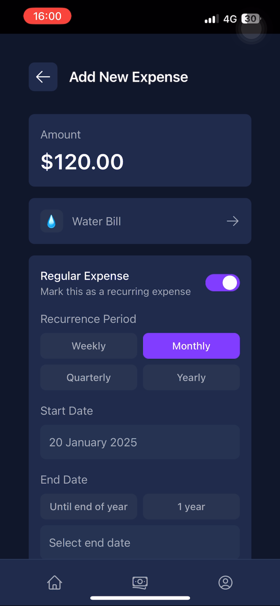

# Budget Tracker

A modern, feature-rich Progressive Web App (PWA) built with React and Supabase. Track your expenses, income, and manage your financial goals with an intuitive user interface. Install it on any device and use it like a native app!

## 🎥 Demo

<div align="center">

### ✨ Experience Budget Tracker in Action

[Watch Full Demo Video](https://drive.google.com/file/d/1kt-mE0WilTwt_Qgp6dZbBXUWF1WEg4rc/view?usp=sharing)

</div>

### 🚀 Featured in Demo

**Core Features**
- 📊 Dashboard & Analytics
  - Real-time financial overview
  - Interactive charts and statistics
  - Monthly spending patterns

- 💰 Transaction Management
  - Adding expenses and income
  - Recurring transaction setup
  - Category management

- 🎯 Smart Features
  - Advanced filtering system
  - Reminder setup process
  - Custom categorization

**Technical Highlights**
- ⚡ PWA Installation
- 📱 Mobile Responsiveness
- 🌙 Dark Mode Interface
- 🔄 Real-time Updates
- 🌐 Multi-language Support

### 🔗 Try It Yourself
Visit our [live demo](https://budget-tracker-2hfy.onrender.com/) to experience the app firsthand!

## 📸 Screenshots

### Authentication
<div align="center">
  <div style="margin-bottom: 20px;">
    <h4>Login Screen</h4>
    
  </div>

  <div style="margin-bottom: 20px;">
    <h4>Registration Screen</h4>
    
  </div>

  <div style="margin-bottom: 20px;">
    <h4>Password Reset Screen</h4>
    
  </div>
</div>

### Dashboard & Overview
<div align="center">
  <div style="margin-bottom: 20px;">
    <h4>Main Dashboard View</h4>
    
  </div>

  <div style="margin-bottom: 20px;">
    <h4>Detailed Dashboard Analysis</h4>
    
  </div>
</div>

### Transaction Management
<div align="center">
  <div style="margin-bottom: 20px;">
    <h4>Income Transactions</h4>
    
  </div>

  <div style="margin-bottom: 20px;">
    <h4>Transaction Deletion Dialog</h4>
    
  </div>

  <div style="margin-bottom: 20px;">
    <h4>Income Filtering Options</h4>
    
  </div>

  <div style="margin-bottom: 20px;">
    <h4>Transaction Details View</h4>
    
  </div>

  <div style="margin-bottom: 20px;">
    <h4>Expense Transactions</h4>
    
  </div>
</div>

### Filtering & Analysis
<div align="center">
  <div style="margin-bottom: 20px;">
    <h4>Expense Filter Interface</h4>
    
  </div>

  <div style="margin-bottom: 20px;">
    <h4>Detailed Filter Options</h4>
    
  </div>
</div>

### Adding New Transactions
<div align="center">
  <div style="margin-bottom: 20px;">
    <h4>New Expense Form</h4>
    
  </div>

  <div style="margin-bottom: 20px;">
    <h4>Category Selection</h4>
    
  </div>

  <div style="margin-bottom: 20px;">
    <h4>Recurring Transaction Setup</h4>
    
  </div>

  <div style="margin-bottom: 20px;">
    <h4>Reminder Configuration</h4>
    
  </div>

  <div style="margin-bottom: 20px;">
    <h4>Payment Method Selection</h4>
    
  </div>
</div>

### User Settings
<div align="center">
  <div style="margin-bottom: 20px;">
    <h4>Profile Settings Panel</h4>
    
  </div>
</div>

## Features

### Progressive Web App (PWA)
- 📱 Install on any device (iOS, Android, Desktop)
- 🔄 Offline functionality
- 🚀 Fast loading and caching
- 📲 App-like experience
- 🔔 Push notifications support
- 🔄 Background sync
- 🔒 Secure HTTPS connection

### Dashboard & Analytics
- 📊 Real-time financial overview
- 💵 Total balance tracking
- 📈 Income and expense summaries
- 🔄 Regular expenses monitoring
- 📅 Monthly financial statistics
- 📱 Responsive design for all devices

### Transaction Management
- 💰 Track both expenses and income
- 🔄 Support for one-time and recurring transactions
- 📅 Flexible date filtering and transaction history
- 📝 Detailed transaction categorization
- 💳 Multiple payment method support
- 🔍 Advanced filtering capabilities (date, regularity, category)

### Smart Features & Filtering
- ⏰ Transaction reminders
- 📱 Push notifications
- 📧 Email notifications
- 🔄 Recurring transaction automation
- 🏷️ Custom categorization
- 📝 Transaction notes and descriptions

### User Experience
- 🌙 Dark mode interface
- 🌐 Internationalization support
- 📱 Mobile-first design
- ⚡ Real-time updates
- 🔄 Infinite scroll for transaction history
- 🎨 Modern and intuitive UI
- 📲 Install and use as native app
- 🔌 Works offline
- 🔄 Automatic updates

## Tech Stack

- **Frontend Framework**: React + Vite
- **PWA Support**: Vite PWA Plugin
- **State Management**: Zustand
- **UI Components**: Shadcn UI, Radix UI
- **Styling**: Tailwind CSS
- **Database**: Supabase
- **Authentication**: Supabase Auth
- **Animations**: Framer Motion
- **Form Handling**: React Hook Form
- **Validation**: Zod
- **Internationalization**: react-i18next
- **Service Worker**: Workbox

## Project Structure

```
src/
├── components/          # React components
├── contexts/           # React contexts
├── hooks/              # Custom hooks
├── pages/              # Application pages
├── services/           # API services
│   ├── supabase/      # Supabase services
│   └── BudgetService.js
├── store/             # Zustand stores
├── styles/            # Global styles
└── i18n/              # Internationalization
```

## Getting Started

### Prerequisites

- Node.js (v14 or higher)
- npm or yarn
- Supabase account

### Installation

1. Clone the repository:
   ```bash
   git clone https://github.com/akingundogdu/budget-tracker.git
   cd budget-tracker
   ```

2. Install dependencies:
   ```bash
   npm install
   # or
   yarn install
   ```

3. Set up environment variables:
   ```bash
   cp .env.example .env.local
   ```
   Fill in your Supabase credentials and other required environment variables.

4. Start the development server:
   ```bash
   npm run dev
   # or
   yarn dev
   ```

5. Open [http://localhost:3000](http://localhost:3000) in your browser.

## Environment Variables

```env
VITE_SUPABASE_URL=your_supabase_url
VITE_SUPABASE_ANON_KEY=your_supabase_anon_key
```

## Supabase Setup

### 1. Create Supabase Project
1. Go to [Supabase Dashboard](https://app.supabase.io)
2. Click "New Project" and fill in the details
3. Choose a database password and region
4. Wait for the project to be created

### 2. Get API Credentials
1. In your project dashboard, go to Settings > API
2. Copy the `Project URL` and `anon public` key
3. Paste them in your `.env` file:
   ```env
   VITE_SUPABASE_URL=your_project_url
   VITE_SUPABASE_ANON_KEY=your_anon_key
   ```

### 3. Database Setup
1. Go to SQL Editor in your Supabase dashboard
2. Run the following migration files in order:

   ```bash
   database/migrations/
   ├── 001_add_description_to_transactions.sql     # Add description field to transactions
   ├── 001_add_is_regular_to_transactions.sql      # Add recurring transaction support
   ├── 002_add_recurring_dates.sql                 # Add start/end dates for recurring transactions
   ├── 002_add_preferred_language_to_profiles.sql  # Add language preferences
   └── 004_add_payment_method_to_transactions.sql  # Add payment method support
   ```

3. Execute each migration file in sequence:
   - Open SQL Editor in Supabase dashboard
   - Copy the content of each migration file
   - Execute them in the order listed above

4. Verify the setup:
   - Go to Database > Tables to see the created tables and columns
   - Check Authentication > Policies to verify RLS policies
   - Test the indexes in Database > Indexes

> **Note**: Migration files are located in the `database/migrations` directory. Each file is prefixed with a number to indicate the order of execution. This approach helps track database changes and makes it easier to replicate the database structure across different environments.

### 4. Enable Authentication
1. Go to Authentication > Settings
2. Enable the authentication providers you want to use (Email, Google, etc.)
3. Configure email templates if using email authentication

### 5. Set up Storage (Optional)
1. Go to Storage in your Supabase dashboard
2. Create a new bucket called 'avatars' for user profile pictures
3. Set up the following storage policy:
```sql
CREATE POLICY "Avatar images are publicly accessible"
  ON storage.objects FOR SELECT
  USING (bucket_id = 'avatars');

CREATE POLICY "Users can upload their own avatar"
  ON storage.objects FOR INSERT
  WITH CHECK (
    bucket_id = 'avatars' 
    AND auth.uid() = owner
  );
```

### 6. Real-time Updates (Optional)
1. Go to Database > Replication
2. Enable real-time for the tables you want to subscribe to
3. Configure the real-time settings according to your needs

## Contributing

1. Fork the repository
2. Create your feature branch (`git checkout -b feature/AmazingFeature`)
3. Commit your changes (`git commit -m 'Add some AmazingFeature'`)
4. Push to the branch (`git push origin feature/AmazingFeature`)
5. Open a Pull Request

## License

This project is licensed under the MIT License - see the [LICENSE](LICENSE) file for details.

## Acknowledgments

- [React](https://react.dev)
- [Vite](https://vitejs.dev)
- [Supabase](https://supabase.io/)
- [Tailwind CSS](https://tailwindcss.com/)
- [Shadcn UI](https://ui.shadcn.com/)
- [Framer Motion](https://www.framer.com/motion/)
